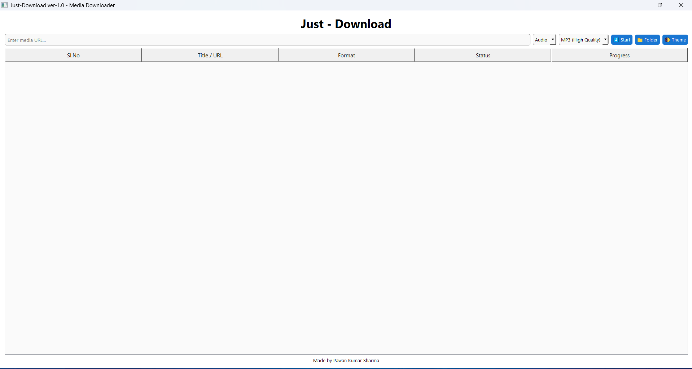
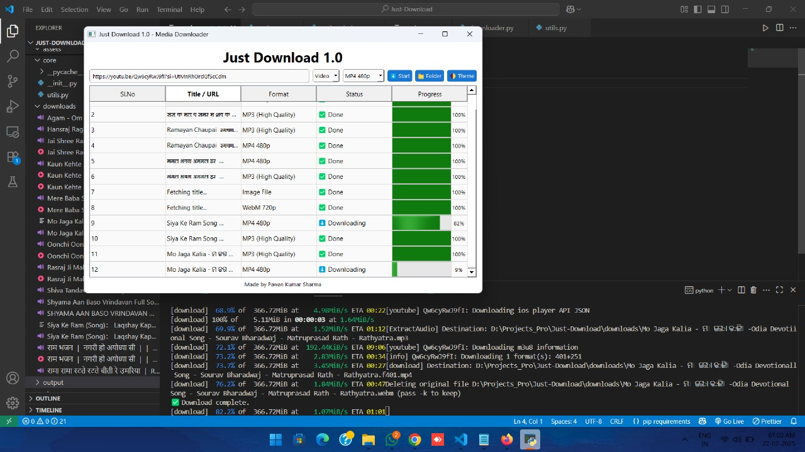

# Just Download ver-1.0  - Media Downloader App 



Just Download is a simple and modern Python-based GUI app to download videos and audio from YouTube and other media platforms. Built using **PyQt5**, **yt-dlp**, and **multithreading**, this app provides a fast and responsive downloading experience.

---

## 🚀 Features

* 🎞️ **Download Video or Audio** from any YouTube or supported URL.
* 💡 Smart format detection (MP4 for video, MP3 for audio).
* 📁 Auto-saves to `downloads/` folder.
* 🌈 Modern UI (PyQt5 + QSS styling).
* ⚙️ Multithreaded downloader - UI never freezes.
* 🔄 Clear logs and input easily.
* 📋 Real-time status updates (success or error).

---

## 🖥️ UI Overview

| Main Screen                                |
| ------------------------------------------ |
|  
|  |

---

## ⚙️ Installation

### 1. Clone the Repository

```bash
git clone git@github.com:itspksharma/just-download.git
cd just-download
```

### 2. Install Dependencies

```bash
pip install -r requirements.txt
```

---

## ▶️ Run the App

```bash
python main.py
```

---

## 📦 Build `.exe` (Optional)

Use `pyinstaller` to convert it into an executable:

```bash
pip install pyinstaller
pyinstaller --noconsole --onefile main.py
```

The generated `.exe` will be in `dist/` folder.

> Note: You may need to handle QSS and assets if you embed them.

---

## 🛠️ Tech Stack

* **Python 3.x**
* **PyQt5** (for GUI)
* **yt-dlp** (backend downloader)
* **Multithreading** (QThread)

---

## 🧾 Folder Structure

```
just-download/
│
├── assets/               # Icons & background (optional)
│   └── screenshots/      # App screenshots for README
│
├── core/
│   ├── utils.py          # Helper functions
│   └── __init__.py
│
├── ui/
│   ├── main_window.py    # Main GUI
│   ├── modern.qss        # Styling (option or add in future ver.)
│   └── __init__.py
│
├── downloader.py         # Download logic (yt-dlp)
├── main.py               # Entry point
├── requirements.txt
└── README.md
```

---

## 🙋 Author

**Pawan Kumar Sharma** ([GitHub @itspksharma](https://github.com/itspksharma))

---

## 📃 License

This project is licensed under the MIT License.

---


